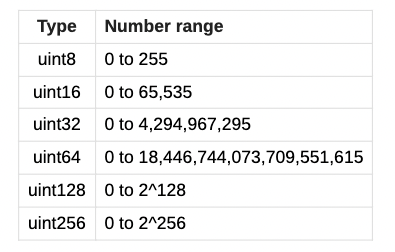
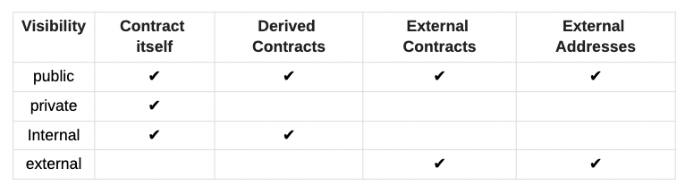
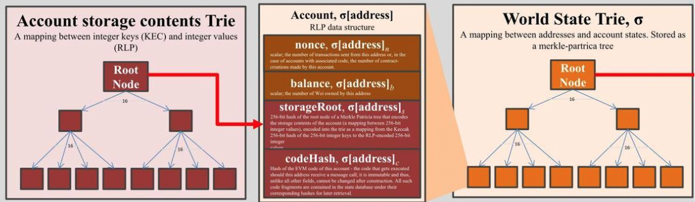
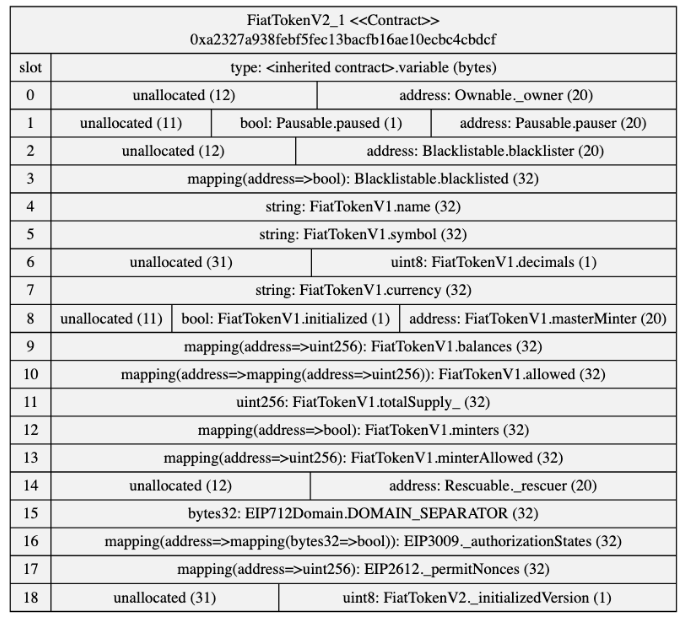
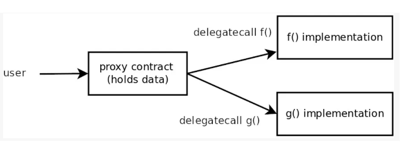
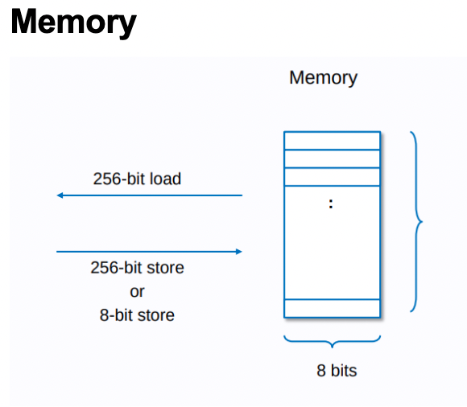
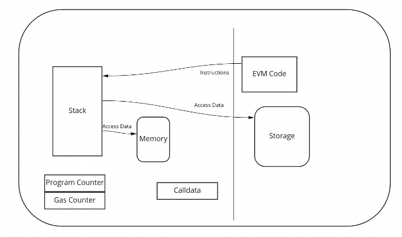
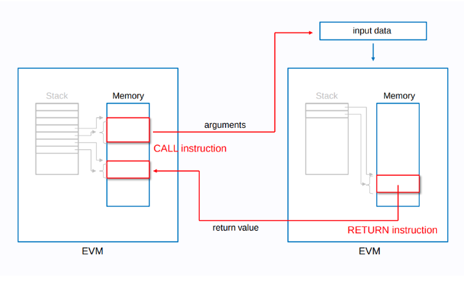

# Lesson 1

## Course Intro

The course will cover topics like blockchain theory, Solidity, the Ethereum Virtual Machine, layer 2 solutions, gas optimization, security, and more advanced concepts.

## Eth intro 

- Intro on TLV for each chains.

- Ethereum is moving towards a more modular architecture with chains specialized for execution, settlement/consensus, and data availability.

- Layer 2 rollups are helping scale Ethereum by executing transactions off-chain and bundling them into the main chain.

- The Ethereum merge changed the consensus mechanism to proof-of-stake, improving finality and reducing centralization risks compared to proof-of-work.

- Intro on bloom filter

- Account abstraction proposals aim to add more functionality like paying fees in other tokens, multi-sig transactions, and social recovery to Ethereum accounts.

- Upcoming concepts like sharding may further improve scalability by distributing data and load across multiple shards (include blob).

# Lesson 2

Solidity Review
Function Selectors
Advanced Solidity Types

```solidity
// define version of the compiler
pragma solidity ^0.8.0;

// 
contract ContractExample {
    uint score = 5;
}
```

## View and pure functions

- View: Functions which do not change any state values
- Pure: Functions which do not change any state values and also do not read any state values

`uint` defines an unsigned integer of 256 bits by default



Tips :
- have a fixed version of the compiler so there is no surprise during the compilation
- try to restrict access as much as possible




## modifier

Definition : A  modifier  is a special function that enables us to change the behaviour of functions in Solidity. (used to automatically check a condition before executing a function)

```solidity
address owner;
    
modifier onlyOwner {
    if (msg.sender == owner) {
       _;
    }
}
function setScore(uint new_score) public onlyOwner {
    score = new_score;
}

```

## constructor

Definition : constructor is a function that is executed only once

```solidity
contract Score {
    address owner;
    constructor() {
        owner = msg.sender;
    }
}
// Outside a function
event myEvent(type1, type2, ... );
// Inside a function
emit myEvent(param1, param2, ... );

```

be carefull with upgradable contract because the behavior is not the same anymor

## Events

Def : They are a way to show the
changes made into a contract

```solidity
// Outside a function
event myEvent(type1, type2, ... );
// Inside a function
emit myEvent(param1, param2, ... );
```

- good practice to use a lot of events (so you can monitor it)

## Mappings

```solidity
mapping(address => uint) score_list;
function getUserScore(address user) public view returns (uint) {
    return score_list[user];
}
```

ps : we can't loop over a mapping in solidity

## Arrays

Fixed size array :  T[k]
Dynamic size array :  T[]

```solidity
uint[] all_possible_number;        
uint[9] one_digit_number;
```

## Struct

```solidity
struct Funder {
   address addr;
   uint amount;
}
```

## Inheritance

```solidity
// SPDX-License-Identifier: GPL-3.0
pragma solidity >=0.7.0 <0.9.0;
contract Owned {
   constructor() { owner = msg.sender; }
   address  owner;
}
// Use `is` to derive from another contract. Derived
// contracts can access all non-private members including
// internal functions and state variables. These cannot be
// accessed externally via `this`, though.
contract Child1 is Owned {
   // The keyword `virtual` means that the function can change
   // its behaviour in derived classes ("overriding").
   function doThings()) virtual public {
       .... ;
   }
}
```

ps : 
- if you change the order of the inheritance chain then it change the inheritance
- don't use

## Enums

`enum ActionChoices { GoLeft, GoRight, GoStraight, SitStill }`

helps make code cleaner

## Storage, memory and calldata

- Storage : costly because has to be cloned by every node in the network
- Memory : used to store data temporarily whilst executing logic 
- Calldata : non-modifiable and non-persistent data location

## Constant and Immutable variables

- cannot be modified in both cases
- For constant variables, the value has to be fixed at **compile-time**, while for immutable, it can still be assigned at **construction** time.
- immutable are good for security

## Interface 

The interface specifies the function signatures, but the implementation is specified in child contracts

## Fallback and Receive functions

## Dealing with errors

- Example : `require(_amount > 0,"Amount must be > 0");`


- security : try to check all inputs to all function (use `require` keyword)
- **require** : used to be sure that something is true (testcases for security)
- **Assert** : creates an error of type Panic(uint256). Not used in every day tests, mostly internal use (working code shouldn't throw this kind of error) 
- **try/catch** : used to catch errors in calls to external contracts

```solidity
try feed.getData(token) returns (uint v) {
    return (v, true);
} catch Error(string memory /*reason*/) {
    // This is executed in case
    // revert was called inside getData
    // and a reason string was provided.
    errorCount++;
    return (0, false);
} catch Panic(uint /*errorCode*/) {
    // This is executed in case of a panic,
    // i.e. a serious error like division by zero
    // or overflow. The error code can be used
    // to determine the kind of error.
    errorCount++;
    return (0, false);
} catch (bytes memory /*lowLevelData*/) {
    // This is executed in case revert() was used.
    errorCount++;
    return (0, false);
}
```

- custom errors : used with the revert statement
```solidity
error NotEnoughFunds(uint requested, uint available);
contract Token {
   mapping(address => uint) balances;
   function transfer(address to, uint amount) public {
       uint balance = balances[msg.sender];
       if (balance < amount)
           revert NotEnoughFunds(amount, balance);
       balances[msg.sender] -= amount;
       balances[to] += amount;
       // ...
   }
}
```
## Compile time

## Using other contract and libraries

**Compile time**

```solidity
pragma solidity ^0.8.0;
import "https://github.com/OpenZeppelin/openzeppelin-contracts
/contracts/utils/math/Math.sol";
contract Test {
   using Math for uint256;
   
     
    function bigger(uint256 _a, uint256 _b) public pure returns(uint256)
{
        uint256 big = _a.max(_b);
        return(big);
   }
}
```

## Precompiled contract

Needed because evm is long to process. 
- drop out the evm 
- the client process (go code or other instead of solidity so better performance)
- pass the result back to the evm (like processed by the evm but it's not)

## Delete 

It help save fees

- `delete myVariable;`
- `myVariable = 0;`
- ...

## Language Changes (0.8.6)

- **event selector**
- assembly memeory safe
- file level library references
- extend comparaison operators
- abi.encodeCall (can call another contract)
- External funciton fields (support .address and .selector)
- Inheritance changed
- Enum min/max
- User defined value type
- london upgrade fee support
- support for Paris hard fork
- deprecation of `selfdescruct`
- named parameters in mappings 
- ...

## Function Selectors

## advanced solidity types

we can create custom solidity types (to wrap and convert to another data type for example)

## Function types

- allow to have a function as a variable and pass it to other functions

# Lesson 3

## Eth data structure

- previously Merkle Patricia Tries / Radix Tries
- now using a verkle tree



[ethereum-state-trie-architecture-explained](https://medium.com/@eiki1212/ethereum-state-trie-architecture-explained-a30237009d4e)

## Ethereum Block Fields

- deposits
- gas_limit
- block_number
- recipient
- signature
- nonce
- value
- data
...

[see doc](https://ethereum.org/en/developers/docs/blocks)

The EVM is a stack machine
ps : Stack != call stack


## Data areas
Data can be stored in
- Stack
- Calldata
- Memory
- Storage
- Code
- Logs

## Data areas - Memory

- it's a byte-array 
- you have to pay for the number of bytes written
- if new area of memory = more expensive

Memory expansion costs scale linearly for the first
724 bytes and quadratically after that".
If you use <=724 bytes of memory the second part of
the equation is 0

## Data areas - Storage

- think : fixed size and dynamic sized variables



## Code execution

### Opcodes

def: low-level machine-level instruction that directly corresponds to a specific operation performed by the (EVM)

ps: every solidity get translated into EVM opcodes during compilation

- stack manipulation opcodes : POP, PUSH, DUP, SWAP
- arithmetic opcodes: ADD, SUB...
- environmental opcodes : CALLER, CALLVALUE, NUMBER
- Memory-manipulating ...
- storage manipulating opcodes
...

### visualisation

You can use Sol 2 UML to visualize solidity contract in uml

# Seance 4

## Upgradability

- be careful because introduce security flaws

// TODO: finish notes

## Diamond pattern 

- is a contract that uses a fallback function to delegate function calls to multiple other contracts called facets
- used / created by aavegotchi
- solve some specific pblm (size...)

##

## Metamorphic Crontracts
## CREATE & CREATE2 & selfdestruct

- reduce the address you need to track as long as the bytecode is the same
- redeploy on top of another contract after selfdestruct (not everybody thinks it's a good idea)

## IDE general techniques from github in Remix
```solidity
import "https://github.com/OpenZeppelin/openzeppelin-contracts/contracts/access/Ownable.sol";
or :
import "@openzeppelin/contracts@4.2.0/token/ERC20/ERC20.sol";
````

## Logging in Remix / hardhat

you can now log by importing log from hardhat

## Forking from mainnet

- You can now fork (make a local copy) from maintnet and help for testing.
- Super cool to interact with aave like if it was on mainnet.
- need a full node (alchemy or infura...)

## Solidity templates

From hardhat : [Link](https://github.com/PaulRBerg/hardhat-template)

- hardhat: compile, run and test sc
- typechain: typescript
- ethers: js
- solhint: linter
- solcover: code coverage

Also :
- Also one from foundry
- don't forget sol2uml

## Boring code is better code

- Foundry is a tool like hardhat but much faster than hardhat
- just use foundry, check their [book](https://book.getfoundry.sh/) and enjoy

## Foundry

### Foundry test

it's a test contract with `assert` etc...

### Foundry with hardhat

- foundry can integrates with hardhat dependencies (node_modules)
- copy one folder + config file etc and you have a working foundry in a hardhat project

### solidity scripting

- a way to deploy with foundry

### Foundry cast

- allow to perform eth RPC from cli

### Cheatcodes

- allow to change the block number


# Seance 5

### Memory



Memory is a byte-array. Memory starts off zero-size, but can be expanded in 32-byte chunks by simply accessing or storing memory at indices greater than its current size.

### Storage 


### Code execution



### OpCodes 

- stack manipulation opcodes (POP, PUSH ...)
- arithmetic/comparision/bitwise opcdes (ADD, SUB ...)
...

- [complete list on ethervm](https://www.ethervm.io/) & on [evm.codes](https://www.evm.codes/?fork=shanghai)
- Can be tried on [evm.codes](https://www.evm.codes/playground?fork=shanghai)

## Assembly

- advantage : it's much more performant.  
- Problem : it's more time consuming and more prone to errors. 

### Notation

```
a + b      // Standard Notation (Infix)
a b add    // Reverse Polish Notation
mstore(0x80, add(mload(0x80), 2))      //  how we write the code
2 0x80 mload add 0x80 mstore           //  How it is represented in bytecode
```

## Assembly example 

check here : https://www.youtube.com/watch?v=RxL_1AfV7N4

## External Calls



## YUL

- with Yul, you don't have to worry about the stack (more dev friendly)
- statiscally typed
- good tutorial : [medium of Jean](https://jeancvllr.medium.com/solidity-tutorial-all-about-assembly-5acdfefde05c)

## YUL syntax overview
- literals
- calls to builtin functions
- variable declarations
- identifiers (variables)
- assignments 
- blocks where local var are scoped inside
- if statement
- switch
- for loops
- function defifitions
- blocks are delimited by `{}`
- variable declarations : `let y := 5`

what do the let keyword ?
- create a new stack slot
- the new slot is reserved for the variable
- the slot is then automatically removed again when the end of the block is reached

